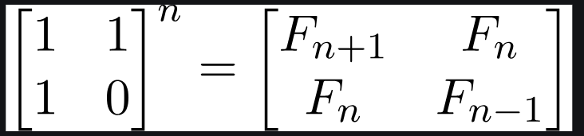
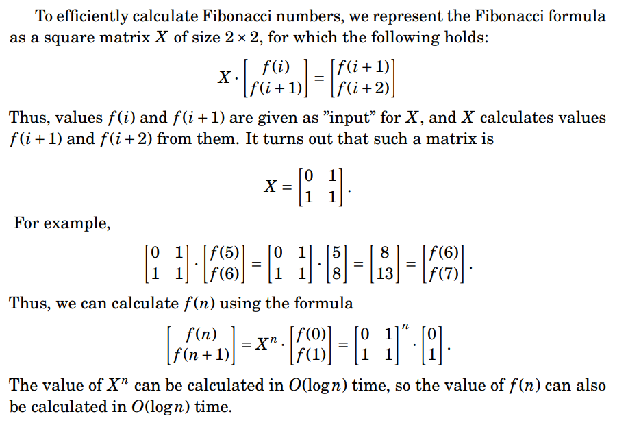
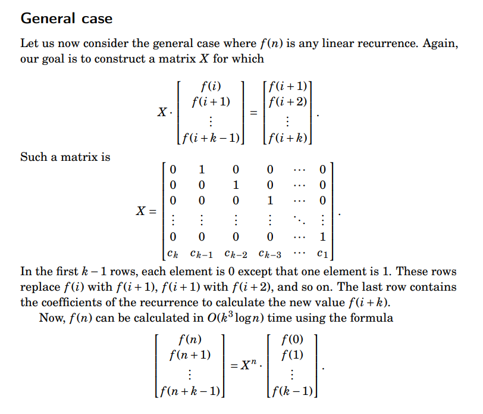

# CSES Notes

## Maths - Fibonacci Numbers :



**See next q for matrix exp.**

Using this we can derive :

- If n is even then k = n/2: Nth Fibonacci Number = F(n) = [2*F(k-1) + F(k)] * F(k)

- If n is odd then k = (n + 1)/2: Nth Fibonacci Number = F(n) = F(k)* F(k) + F(k-1)* F(k-1)

Code snippet :

```cpp
const int MOD = 1e9 + 7;
map<ll, ll> fib; // you can't make an array of size 1e18
ll f(ll n)
{
    if (n == 0)
        return 0;
    if (n == 1)
        return 1;
    if (fib.find(n) != fib.end())
        return fib[n];
    if (n % 2)
    {
        ll k = (n + 1) / 2;
        ll a = f(k) % MOD;
        ll b = f(k - 1) % MOD;
        return fib[n] = ((a * a) % MOD + (b * b) % MOD) % MOD;
    }
    else
    {
        ll k = n / 2;
        ll a = f(k) % MOD;
        ll b = f(k - 1) % MOD;
        return fib[n] = (a * ((a + (2 * b % MOD)) % MOD)) % MOD;
    }
    return -1;
}
```

## Maths - Throwing Dice :

### Matrix Exponentiation : 

Any linear recurrence can be expressed as a matrix * vector leading to a new vector.

That also holds true for any dp you can solve in O(1) space (generally).

So if next term comes by Ax = b, then you can get nth term by A^n*x.

You can get A^n quickly by matrix exponentiation, ie finding power just like you do for bin_exp.
This speeds up from O(n) to O(lg n).

So reform your dp, write it as transformation matrix, and use matrix exp to speed it up.

One nice way to do that is formulate such that : new_dp[i] += dp[j] * a[i][j]

If your new state depends on k values, matrix will be of k * k and vector of k * 1.
So to be more precise : The matrix multiplication algorithm will have a complexity of O(k^3). Hence, the overall complexity turns out be O(k^3 * log(n)).





Code Snippet : 

```cpp
// Matrix Exp template
const int MOD = 1e9 + 7;
using Matrix = array<array<ll, 2>, 2>; // change 2 to order of matrix
Matrix mul(Matrix a, Matrix b)
{
    Matrix res = {{{0, 0}, {0, 0}}};
    for (int i = 0; i < 2; i++)
        for (int j = 0; j < 2; j++)
            for (int k = 0; k < 2; k++)
            {
                res[i][j] += a[i][k] * b[k][j];
                res[i][j] %= MOD;
            }
    return res;
}

Matrix mat_exp(Matrix a, ll b)
{
    Matrix res = {{{1, 0}, {0, 1}}};
    while (b > 0)
    {
        if (b & 1)
            res = mul(res, a);
        a = mul(a, a);
        b >>= 1;
    }
    return res;
}

// Evergreen Fibonacci
int main()
{
    ll n;
    cin >> n;
    ll dp[2] = {0, 1};
    Matrix a = {{{0, 1}, {1, 1}}};
    a = mat_exp(a, n);
    ll new_dp[2] = {0, 0};
    for (ll i = 0; i < 2; i++)
        for (ll j = 0; j < 2; j++)
            new_dp[i] += dp[j] * a[i][j];
    cout << new_dp[0];
    return 0;
}
```

**Linear Recurrence for Throwing Dice**:

*f(n) = sum(f(n-i)) : i - 1 to 6 for n>=6*

Impl :

```cpp
const int MOD = 1e9 + 7;
using Matrix = array<array<ll, 6>, 6>;
Matrix mul(Matrix a, Matrix b)
{
    Matrix res = {{{0, 0, 0, 0, 0, 0},
                   {0, 0, 0, 0, 0, 0},
                   {0, 0, 0, 0, 0, 0},
                   {0, 0, 0, 0, 0, 0},
                   {0, 0, 0, 0, 0, 0},
                   {0, 0, 0, 0, 0, 0}}};
    for (int i = 0; i < 6; i++)
        for (int j = 0; j < 6; j++)
            for (int k = 0; k < 6; k++)
            {
                res[i][j] += a[i][k] * b[k][j];
                res[i][j] %= MOD;
            }
    return res;
}

Matrix mat_exp(Matrix a, ll b)
{
    Matrix res = {{{1, 0, 0, 0, 0, 0},
                   {0, 1, 0, 0, 0, 0},
                   {0, 0, 1, 0, 0, 0},
                   {0, 0, 0, 1, 0, 0},
                   {0, 0, 0, 0, 1, 0},
                   {0, 0, 0, 0, 0, 1}}};
    while (b > 0)
    {
        if (b & 1)
            res = mul(res, a);
        a = mul(a, a);
        b >>= 1;
    }
    return res;
}

int main()
{
    ll n;
    cin >> n;
    ll dp[6] = {1, 1, 2, 4, 8, 16};
    Matrix a = {{{0, 1, 0, 0, 0, 0},
                 {0, 0, 1, 0, 0, 0},
                 {0, 0, 0, 1, 0, 0},
                 {0, 0, 0, 0, 1, 0},
                 {0, 0, 0, 0, 0, 1},
                 {1, 1, 1, 1, 1, 1}}};
    a = mat_exp(a, n);
    ll new_dp[6] = {0, 0, 0, 0, 0, 0};
    for (ll i = 0; i < 6; i++)
        for (ll j = 0; j < 6; j++)
        {
            new_dp[i] += dp[j] * a[i][j];
            new_dp[i] %= MOD;
        }
    cout << new_dp[0] << "\n";
    return 0;
}
```
**Note:** No need to enforce n>=6 condition since before that the multiplication only shifts vector elements and hence the first element still carries the right answer.

## Maths - Graph Paths I :

A directed, unweighted graph with n vertices and m edges and we are given an integer k. For each pair of vertices (i, j) we have to find the number of paths of length k between these vertices. Paths don't have to be simple, i.e. vertices and edges can be visited any number of times in a single path.

No of paths of length k from i to j = A^k[i][j], where A is adjacency matrix of the graph.

Total no of paths of length k -> Sum over all values of A^k[i][j].

So just do mat_exp of adjacency matrix A to power k.

See AC CSES submission if any doubt.

## DP - Counting Numbers

### Digit DP

- Allows us to solve mainly two types of problems:
  1. Count of no of integers X in [0, R] such that f(X) = true (where f(X) is a function which only returns true or false)
   
   For small R, you can iterate over all integers from 0 to R but what about R upto 1e18 or larger.
   
   In that case you will make use of properties of digits using digit DP.

  2. Count of no of integers X in [L, R] such that f(X) = true : Very easy if you did the first and got ans as S(R), then ans for second is S(R) - S(L-1).

- Hence, Digit DP can be used to solve problems that ask for how many integers in a range have some property. The crux of it lies in the fact that the necessary information for each state does not necessarily have to be an entire integer, but rather some information pertaining to digits. Then since the full information of an integer is not in our state, it turns out that multiple integers can be represented by a single state, which obviously reduces the time complexity.

- L and R can be made into strings so that large numbers that would normally overflow 64 bit integers can be used. Just that you will need to find L-1.

- IMP points of almost every digit DP question : 
  - You will build number digit by digit from left to right
  - Digits that can be placed vary from 0 to (actual digit) or 9 --> decided by *tight* constraint
  - Some valid numbers may be skipped due to leading zeroes (like in our question), to avoid that we carry a boolean - *started* to see if the number has started or are we still in the leading zeroes phase.
  - Propagating constraints : (tight && (dig == ub)), (started || (dig != 0)), 
    ie, if already tight and dig is upper bound then tight remains true else becomes false. Once started becomes true it remains true, or if it was false but we got our first non zero digit then started is true.
  - Memoization tends to be easier and a better choice.

- For more insight into general digit DP and approach for this question in particular : Read code, comments and this link : https://codeforces.com/blog/entry/111675

## DP - Projects

Let dp[i] denote optimal reward for projects (p1, p2, ... pi)

Then our required ans = dp[n]. Base case : dp[0] = 0

Recurrence :
```
dp[i] = max(dp[i-1], reward[i] + dp[j])
        where pj denotes first project before pi that you can do
        ie : j such that e[j]<s[i] and e[j] is largest
```

Clearly, you can easily get j as lower bound of s[i] over sorted ending times.

T.C : O(n*lg n)