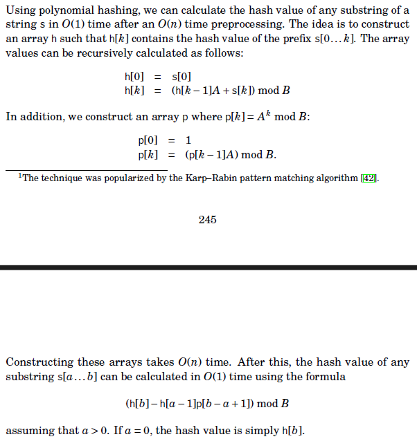
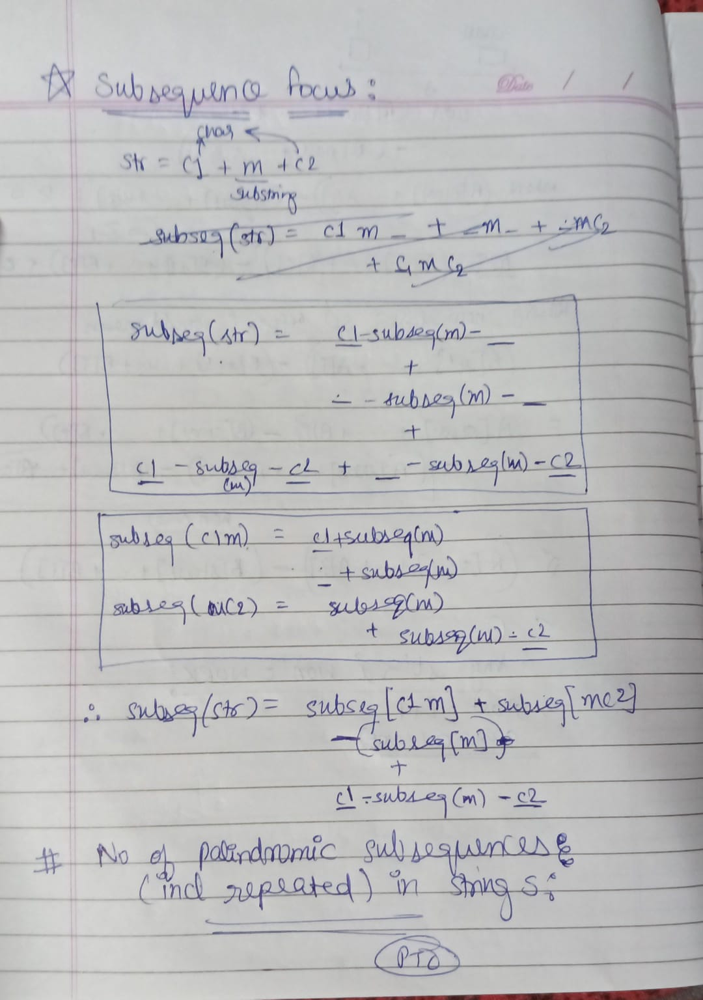
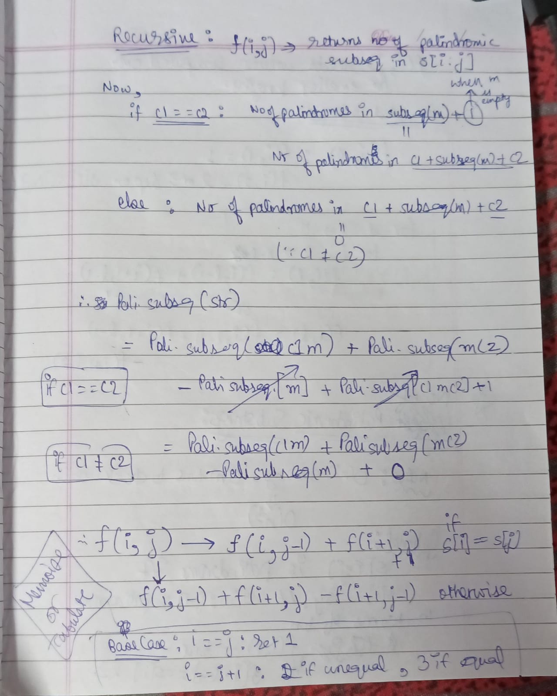
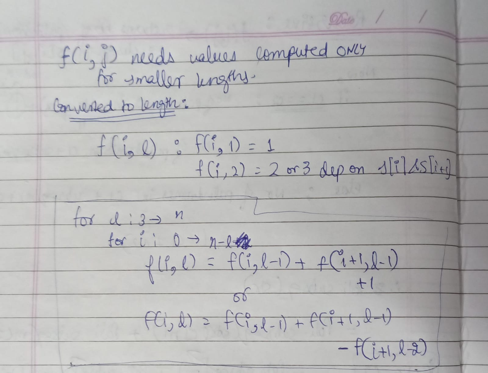
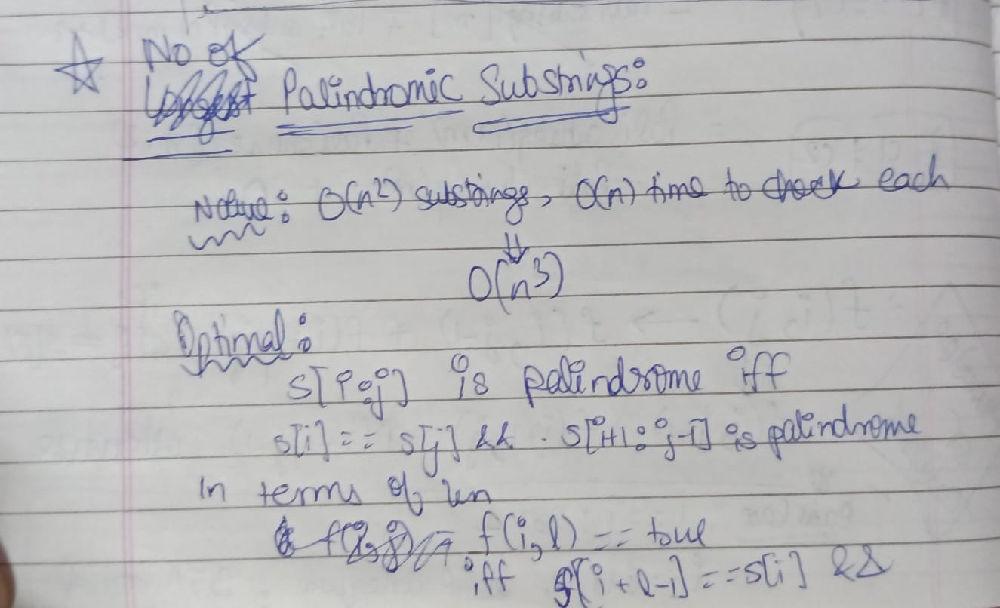
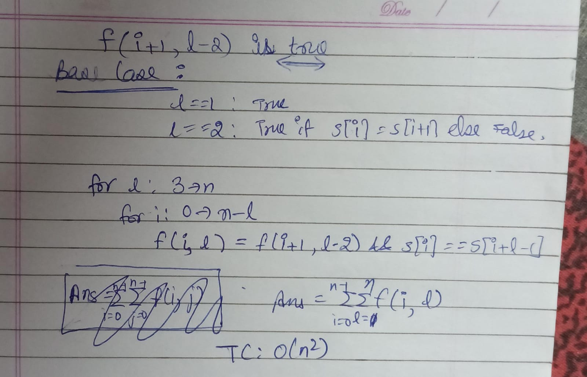

# String Algorithms

## Terms

- **Rotation** : A rotation can be generated by moving the characters of a string one by one
from the beginning to the end (or vice versa). For example, the rotations of ABCD
are ABCD, BCDA, CDAB and DABC.

- **Period** : A period is a prefix of a string such that the string can be constructed by
repeating the period. The last repetition may be partial and contain only a prefix
of the period. For example, the shortest period of ABCABCA is ABC.

- **Border** : A border is a string that is both a prefix and a suffix of a string. For example,
the borders of ABACABA are A, ABA and ABACABA.

## String Hashing

The goal of it is to convert a string into an integer, the so-called hash of the string. The following condition has to hold: if two strings $s$ and $t$ are equal ($s = t$), then also their hashes have to be equal ($\text{hash}(s) = \text{hash}(t)$). Otherwise, we will not be able to compare strings.

So to compare two strings , we compare their hashes. If unequal hashes => unequal strings else equal hashes => most likely equal strings.

Usually we want the hash function to map strings onto numbers of a fixed range $[0, m)$ , then comparing strings is just a comparison of two integers with a fixed length. And of course, we want $\text{hash}(s) \neq \text{hash}(t)$  to be very likely if $s \neq t$ .

Using hashing will not be 100% deterministically correct, because two complete different strings might have the same hash. However, in a wide majority of tasks, this can be safely ignored as the probability of the hashes of two different strings colliding is still very small.

The good and widely used way to define the hash of a string $s$  of length $n$  is **polynomial rolling hash function**
 
$$\begin{align} \text{hash}(s) &= \sum_{i=0}^{n-1} s[i] \cdot p^i \mod m,\end{align}$$ 

 or 

$$\begin{align} \text{hash}(s) &= \sum_{i=0}^{n-1} s[i] \cdot p^{n-1-i} \mod m \end{align}$$ 

where $p$ and $m$  are some chosen, positive numbers.

It is reasonable to make $p$  a prime number roughly equal to the number of characters in the input alphabet. For example, if the input is composed of only lowercase letters of the English alphabet, $p = 31$ is a good choice. If the input may contain both uppercase and lowercase letters, then $p = 53$  is a possible choice.

$m$ should be a large prime. eg 1e9 + 9

Value for each character can be taken : 1 - 26 way or ASCII values or any other way.

**For second type of rolling hash function** :

Explanation :



Implementation :

`string_hashing.cpp`

This implementation calculates

$$\texttt{hsh}[i + 1] = \left(\sum_{x = 0}^i p^{i - x} \cdot S[x]\right) \bmod m$$

The hash of any particular substring $S[a : b]$ is then calculated as

$$\left(\sum_{x = a}^b p^{b - x} \cdot S[x] \right) \bmod m = (\texttt{hsh}[b + 1] - \texttt{hsh}[a] \cdot p^{b - a + 1}) \bmod m$$

using prefix sums. This is nice because the highest power of $p$ in that
polynomial will always be $p^{b - a}$. (Just reiterating what was in the image)

In C++, a virtually unhackable way of generating $p$ in the implementation
above is to use a random number generator seeded with a high-precision clock,
as described here.

```cpp
mt19937 rng((uint32_t)chrono::steady_clock::now().time_since_epoch().count());
const ll p = uniform_int_distribution<ll>(0, m - 1)(rng);
```

## Rabin Karp

Searching for all occurences of pattern s in text t.

Algorithm :

- Preprocessing for hash of text => O(t)
- Hash of pattern => O(s)
- For all substrings of length |s| of t (no = t - s + 1 or O(t)), get hash of substring by above method in O(1) , if equal to hash(s), found one match there => O(t)
- Enumerate all matches like above
- **TC : O(s+t)**

## Z-function

Read directly : 
https://cp-algorithms.com/string/z-function.html

## KMP

Focus on implementations directly which are mentioned here :

- Computing prefix array of string s :
```cpp
vl prefix_function(string s)
{
    ll n = s.length();
    vl pi(n);
    for (ll i = 1; i < n; i++)
    {
        ll j = pi[i - 1];
        while (j > 0 && s[i] != s[j])
            j = pi[j - 1];
        if (s[i] == s[j])
            j++;
        pi[i] = j;
    }
    return pi;
}
```

TC : O (n)

- Find pattern p in text s : 
  - Create string as p + $ + t.
  - Compute prefix array of new string
  - Look for i in text s.t pi[i] == |p| => Indicates last index of a match found in text

```cpp
vl find_matches(string pat, string text)
{
    ll n = pat.length(), m = text.length();
    string s = pat + "$" + text;
    vl pi = prefix_function(s);
    vl ans;
    for (ll i = n + 1; i <= n + m; i++)
    { // n + 1 is where the text starts
        if (pi[i] == n)
            ans.push_back(i - 2 * n); 
			// i - (n - 1) - (n + 1)
    }
    return ans;
}
```

TC : O(n+m) ; SC : O(n+m)

*See more applications here if time. : https://cp-algorithms.com/string/prefix-function.html*

## Tries + Aho Corasick 

A trie is a rooted tree that maintains a set of strings. Each string in the set
is stored as a chain of characters that starts at the root. If two strings have a
common prefix, they also have a common chain in the tree.

We will denote the total length of constituent strings by $m$  and the size of the alphabet by $k$ . 

Basic trie implementation for template : 

```cpp
const int alpha = 26;
struct trie_node
{
    ll next[alpha];
    bool flag = false;
    trie_node()
    {
        for (ll i = 0; i < alpha; i++)
            next[i] = -1;
    }
};

vector<trie_node> tri;
// initialise with empty root inside driver (emplace_back)

void insert_string(string const &s)
{
    ll v = 0;
    for (char c : s)
    {
        if (tri[v].next[c - 'a'] == -1)
        {
            tri[v].next[c - 'a'] = tri.size();
            tri.emplace_back();
        }
        v = tri[v].next[c - 'a'];
    }
    tri[v].flag = true;
}

bool search_string(string const &s)
{
    ll v = 0;
    for (char c : s)
    {
        if (tri[v].next[c - 'a'] == -1)
            return false;
        v = tri[v].next[c - 'a'];
    }
    return tri[v].flag;
}
```


Here, we store the trie as an array of trie_node. Each node contains a flag and the edges in the form of an array $\text{next}[]$ , where $\text{next}[i]$  is the index of the vertex that we reach by following the character $i$, or $-1$ if there is no such edge. Initially, the trie consists of only one vertex - the root - with the index $0$.

Space : O(mk)

Insertion or searching TC : O(n) -> n is length of particular key

**Complete bit trie and example qs on max XOR : bit_trie.cpp**

### Aho Corasick Algorithm

**Main use : Get all occurences of a set of patterns in a given text in linear time.**

The algorithm constructs a finite state automaton based on a trie in and then uses it to process the text.

I won't describe the algorithm but it constructs a trie on set of patterns and adds suffix and output links in $O(mk)$ time as preprocessing and matches with text of length n in $O(n)$ time. 

**Suffix link** :  Suffix link for a vertex $p$ is an edge that points to the longest proper suffix of the string corresponding to the vertex $p$ . 

**Output link** : A suffix link pointing to a pattern in the set.

You can call KMP to be a special case of ACA with a single pattern.

If **really** interested : https://cp-algorithms.com/string/aho_corasick.html

### NOTE

Always target a question using :

- Hashing
- KMP
- Manacher
- Trie
- Aho Corasick (last resort)

Others shouldn't be needed.

---

### No of palindromic subsequences

- 
- 
- 

### No of palindromic substrings

- 
- 

## Manacher

Read here : https://cp-algorithms.com/string/manacher.html

Impl : `manacher.cpp`

TC : O(n)

---