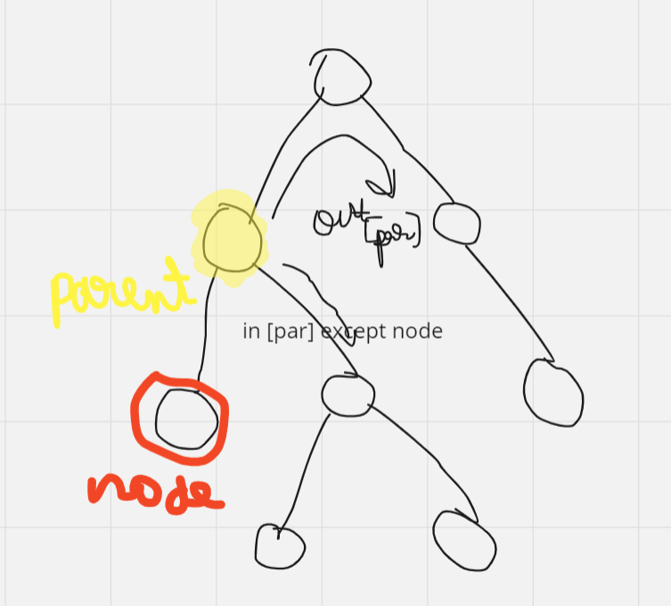
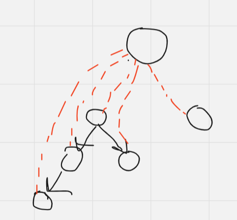
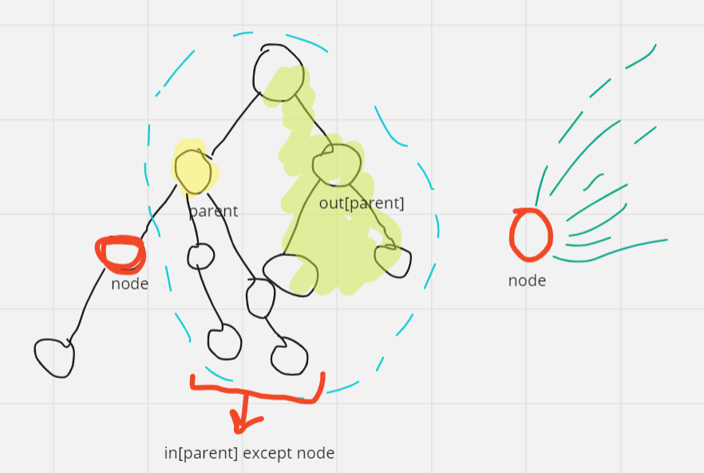

# Trees ( + Successor Graphs)

## Definition & Terms

- An acyclic connected and undirected graph
- It contains $N$ nodes and $N-1$ edges
- Every pair of nodes has exactly one simple path between them
- **Forest** : A graph such that each connected component is a tree
- A star graph has two common definitions:
  1. Only one node has degree greater than 1
  2. Only one node has degree greater than 2
- The subtree of a node $n$ are the set of nodes that have $n$ as an ancestor. A node is typically considered to be in its own subtree

*For graphs in general : If a component of a graph contains c
nodes and no cycle, it must contain exactly c-1 edges (so it has to be a tree). If
there are c or more edges, the component surely contains a cycle.*

## Tree traversal & DP

### General Approach for Tree+DP

The typical way to traverse a tree is to start a depth-first search at an arbitrary node.
eg:
```cpp
void dfs(int s, int e) 
{
// process node s
for (auto u : adj[s])
    if (u != e)
        dfs(u, s);

}
```

The function is given two parameters: the current node s and the previous
node e. Unlike DFS on graphs, here you don't require a visited array bcoz it is not possible to reach a node from multiple directions.

- Decide what info you wish to store for each node (DP state)
- Root the tree at node 1 (usually)
- Identify the base case -> usually of form dp[leaf] = something
- Identify the recurrence (transition of states)
- Implementation is generally via DFS -> compute for children and combine to get state of current node

General template

```cpp
bool isLeaf(ll u, vl adj[])
{
    if (u != 1 && adj[u].size() == 1)
        return true;
    return false;
}

void dfs(ll s, ll e, vl adj[], vl &dp)
{
    if (isLeaf(s, adj))
    { // leaf base case
      // dp[s] = something;
        return;
    }
    for (auto u : adj[s])
    { // computing for children
        if (u == e)
            continue;
        dfs(u, s, adj, dp);
    }
    for (auto u : adj[s])
    { // combining for current node
        if (u == e)
            continue;
        // recurrence relation here
    }
}

void solve()
{
    ll n, a, b;
    vl v;
    cin >> n;
    vl adj[n + 1];
    for (ll i = 2; i <= n; i++)
    {
        cin >> a >> b;
        adj[a].emplace_back(b);
        adj[b].emplace_back(a);
    }
    vl dp(n + 1, 0);
    dfs(1, 0, adj, dp);
}
```

### Subordinates: 

Code Saved.

We use DP on the recursive DFS fn to get number of nodes in subtree of every node (subtree includes the node itself).

No of subordinates is this count excluding the node itself, hence -1.

**T.C : $O(n)$**

### Tree Matching :

DP on Trees:

dp[v][0] = Maximum edges if v is not taken with an edge to its child

dp[v][1] = Maximum edges if edge of v with its child is included

If v is not included => any of its children are free to be included or excluded independently (we take what's better)

If v with edge to child is included, the child with which it shares the edge can't be included with edge to its child, others are free. We need to make the edge with the child that offers the best combination

dp[v][0] = sum(max(dp[u][0], dp[u][1])) where u belong to children of v

dp[v][1] = max( 1 + dp[i][0] + sum(max(dp[j][0], dp[j][1]))-> summed over all j not equal to i )

This simplifies to (for sake of single index) : 

dp[v][1] = max(1 + dp[v][0] + dp[u][0] - max(dp[u][0], dp[u][1])) 

dp[v][1] = 1 + dp[v][0] - min(max(dp[u][0], dp[u][1]) - dp[u][0])

over all children u of v

Base case : dp[leaf] = {0,0}

See code for clarity. T.C : O(n)

Greedy Strategy : https://usaco.guide/gold/dp-trees?lang=cpp

### CF - 1528A

**Can See** : Nice hard question about identifying DP states and transition.

## Diameter:

For graph: Diameter refers to longest of the shortest distances between any pair of nodes. => O(n^3) by Floyd Warshall

Difficult to do more efficiently for a general graph

However, it can be found for trees in O(n)

Code saved for both approaches.

The diameter of a tree is the maximum length of a path between two nodes in the tree. (May or may not pass through root)

Obviously, ends of a diameter are always leaves. There may be several maximum-length paths.

### Method-1 : DP :

**States:**

dp[u][0] = max distance b/w any 2 nodes in the subtree of u such that the path b/w those 2 nodes contains u and *has an endpoint at u*

dp[u][1] = max distance b/w any 2 nodes in the subtree of u such that the path b/w those 2 nodes contains u and *doesn't have an endpoint at u*

**Base case:**

If u is a leaf node, subtree does not have 2 nodes => dp[u][0] = dp[u][1] = 0

**Recurrence:**

dp[u][0] = 1 + max(dp[v][0]), v belongs to children of u

dp[u][1] : Maximum distance between two distinct children of u, let them be v1 and v2.

then ans = dp[v1][0] + dp[v2][0] + 2

=> dp[u][1] = max(dp[i][0] + dp[j][0]) + 2, where i and j are children of u and i not equal to j

Since we need largest of dp[v][0] of children in both cases, it is a good idea to put dp[v][0] in a vector and sort in descending order.

Final ans = max(max(dp[u][0], dp[u][1])) for all vertices u in the tree.

T.C : Sorting makes it O(n*lgn) though you can also work without sorting in O(n)

### Method-2 : 2 BFS :

First, we choose an arbitrary node a in the tree and find the
farthest node b from a. Then, we find the farthest node c from b. The diameter
of the tree is the distance between b and c.

T.C : O(n)

### CF - 1083A

Nice hard question based on diameter DP approach, **look only if time**.

Editorial : Adhish K DP on Trees playlist

## All Longest Paths - Tree Distances I

Interestingly, you can take maximum of values for all nodes (or even just the leafs) and that will give you the tree diameter.

### Method-1 DP:

**In-Out DP** aka **Rerooting**

Longest distance = max(dist to node in own subtree *IN* , dist to node outside own subtree *OUT*)



in[node] = 1 + max(in[children]); Base case : in[leaf] = 0

out[node] = 1 + max(in[parent] (other than node), out[parent]); Base case : out[root] = 0

Then ans[i] = max(in[i], out[i])

How to take max of in[node] while excluding a particular child?

Store two best values of in[node] during first dfs. If the current child's led to the best value, take the second best; otherwise take the best value.

**IMP** : in[node] depends on in[children] => first dfs and compute for children then yourself. But out[node] depends on out[parent] => first compute for yourself then dfs and compute for children

T.C : O(n)

### Method-2 BFS:

We need distance of farthest leaf from our node. The farthest leaf must be one of the ends of the diameter.

(**Proof by contradiction** : Because if some third leaf is farther from our node then any of the ends => that third node can make a longer diameter, which is not possible)

So we find the two ends of the diameter via BFS (like described earlier). We then find distance of every node from these ends via BFS.

max_dist[i] = max(dist_from_a[i], dist_from_b[i])

See code for clarity. T.C : O(n)

## Tree Distances II

**In-Out DP**

DP is similar to Tree Distances I with two dfs calls

Sum of paths = Sum of paths to nodes in own subtree + Sum of paths to nodes outside own subtree

in[node]:



A node extends path to all nodes in subtrees of its children by 1 (incl paths to the children which have current length = 0) => Sum of paths from them increases by their subtree size (incl the root bcoz you are initiating a new path to it)

in[node] = sum(in[children]) + sum(sub[children]); Base case : in[leaf] = 0, sub[leaf] = 0



Node extends all paths coming from its parent by 1 => this includes all paths in the tree except the node's own subtree.
=> out[node] = coming_sum + (n - sub[node])

coming_sum = in[parent] (except node) + out[parent] = in[parent] - (in[node] + sub[node]) + out[parent]

Base case : out[root]=0

and final ans[i] = in[i] + out[i]

**Alternate DP soln** : https://usaco.guide/problems/cses-1133-tree-distances-ii/solution

T.C : O(n)

## Binary Tree Points:

- Postorder + Inorder and Preorder + Inorder **uniquely determine** a tree
- *But Postorder + Preorder don't*

# Tree Queries:

## kth Ancestor:

The kth ancestor of a node x in a rooted tree is the node that we will reach if we move k levels up from x. 

Let ancestor(x,k) denote the kth ancestor of a
node x (or 0 if there is no such an ancestor).

Naive : O(k) for each query

### **Binary lifting**

Any value
of ancestor(x,k) can be efficiently calculated in O(logk) time after preprocessing.

The idea is to precalculate all values ancestor(x,k) where k <= n is a power of two.
The preprocessing takes O(n*logn) time, because O(logn) values are calculated
for each node. 

We use this recurrence to preprocess values via DP : 

```
dp[i][k] = dp[dp[i][k-1]][k-1]

where we go 2^k levels up.
```

Clearly, going 2^k levels up is same as going 2^(k-1) levels and again 2^(k-1) levels from where you reach.

After this, any value of ancestor(x,k) can be calculated in O(log k)
time by representing k as a sum where each term is a power of two, since such summands are O(log k). If k is even on the order of n as in the "worst case" tree (linked list), we can still answer q queries in this way in O(n log(n)) preprocessing and then O(log(n)) per query for q queries, for a total of O((n+q)*log n)

### Company Queries I

Exact idea of binary lifting for kth ancestor. T.C : O((n+q)*log n)

Read code for clarity.

## Subtree and path queries

### **Tree flattening (or Euler Tour)**

- Puts nodes into an array based on DFS traversal of tree.

Code Snippet:

```cpp
void Traversal(ll node)
{ // euler tour
    start[node] = timer;
    timer++;    // --> placing here gives subtree as [start, end-1]
    for (auto x : children[node])
    {
        if (x == parent[node])
            continue;
        // timer++; placing here instead gives subtree as [start, end]
        parent[x] = node;
        Traversal(x);
    }
    ending[node] = timer;
}
```

TC : O(n)

- Every node has a unique start value according to which the nodes (or their values) can be sorted.
- For every node i, nodes in its subtree occupy adjacent indices in the new array.
- The subtree nodes occupy range : start[i] -> end[i]-1 (see above code) with root of subtree at start[i] => size of subtree = end[i] - start[i]
- Any queries on array ranges are equivalent to subtree queries and can be supported similarly using different techniques like fenwick, segtree, lazy propagation etc
  
### Subtree Queries

- In the traversal array : we need to support subtree sum => range sum and node update => point update
- That is, we need Dynamic RSQ -> one possible way is segtree
- See code for clarity. TC : O(n + q*lg n)

### Path Queries

- Interesting observation : Path from root to node s can be obtained from euler tour, by ignoring some branches.
- Basically subtrees whose roots have *ended* when we first reach s need to be ignored
- How to factor out a subtree in a traversal array? Modify the traversal array : 
  - Assign a different start and end time to each node.
  - Create a single array of size 2*n and assign val to start[i] and -val to ending[i]
  - This helps in nullifying nodes which you want to ignore
- Then sum of values from start[root], ie 0 to start[node] gives the sum of values in path from root to node => Range sum
- And updates also happen at two points in the array -> start[node] and ending[node]
- That is we need dynamic RSQ => Segtree can be used
- See code for clarity. TC : O(n + q*lg n)

<!-- ### Path Queries II -->

## LCA

The lowest common ancestor of two nodes of a rooted tree is the lowest node
whose subtree contains both the nodes. 

Code saved in Distance Queries.

### Method-1 : Binary Lifting

- Two pointers to the desired nodes. Move one pointer above using *kth ancestor idea* so that both
pointers point to nodes at the same level.
- If both point to same node => ie LCA, return it
- Else keep moving the pointers up by largest powers of 2 until the nodes have different ancestors
- You will end in a situation where the parent of the nodes pointers currently point to is the LCA, return it
- Each query in O(lg n)

### Method-2 : Euler Tour

- We will use DFS to produce a different kind of traversal array.
- We add each
node to the array *always* when the depth-first search walks through the node,
and not only at the first visit. 
- Hence, a node that has k children appears k+1 times in the array and there are a total of 2n-1 nodes in the array.
- LCA(a,b) = Node with min depth between nodes a and b in the array
- But if a and b occur multiple times, then we need to focus on range between their first occurences. For that we also need to store the index of first occurence of each node in the traversal array
- So LCA becomes : Node with min depth between first[a] and first[b]
- That is if no updates are performed, the LCA problem transforms into a *Static RMQ* problem.
- T.C for Static RMQ : 
  - Segment Tree : O(n + q*lg n) (preprocessing + queries)
  - Sparse Table : O(n*lg n + q) (preprocessing + queries)

### Method-3 : Tarjan's Offline Algorithm

- Handles queries in a different order
- Can refer CPH or cp-algo if u wish

### Method-4 : Farach-Colton and Bender algorithm

- Other methods with O(n) preprocessing and O(1) per query exist but not needed in general
- RMQ can be solved via this approach also.
- Can refer cp-algo or CF blogs

### Company Queries II

Finding LCA for given nodes. See code for clarity. 

### Distance Queries

Find LCA and dist = level[a] + level[b] - 2 * level[c]. 

Two approaches saved for LCA. See code for clarity.

## Successor / Functional Graphs:

Directed graphs with every node having **outdegree = exactly 1**

succ(x) : where x is a node is a function (every x has a single successor) => hence k/a functional graphs

succ(x,k) : Node that we will reach if we begin at
node x and walk k steps forward

Computing succ(x, k):

Naive - O(k) per query

Binary Lifting - O (lg k) per query with O(n lg u) preprocessing where u is the maximum steps queried

### Planet Queries I

Computing succ(x, k). See code for clarity.

Vectors give TLE. T.C : O((n+q)*log u), u = 1e9 here

<!-- ### Planet Queries II

### Planet Cycles -->